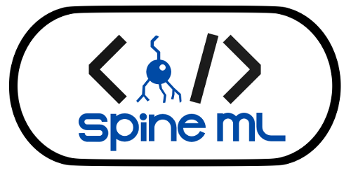

# Computational Biology

The [FLAME GPU](../FLAMEGPU) software has immediate application in a number of research domains whoever computational biology simulation at the cellular level is an ideal candidate. The level of behaviour modelled at the cellular, combined with the level of scale required for realistic simulations makes GPU acceleration highly applicable. In some cases speed-ups of over $$100\times$$ can be observed when comparing with traditional serial simulation approaches. 

# Computational Neuroscience and Neuro-informatics

Neural simulation (computational neuroscience) and neural language design (neuro-informatics) share many of the same problems as general complex systems simulation (with the advantage that neurons tend not to migrate ). First of all large scale simulation requires novelty in the application of parallel hardware architectures, secondly appropriate software tools and languages are required for describing models using high level abstractions which promote automatic parallelisation. 

With respect to neural simulation I am working with [Professor Daniel Coca](https://www.sheffield.ac.uk/acse/staff/dc) (Department of Automatic and control Systems Engineering, The University of Sheffield) and Professor [Aurel Lazar](http://www.ee.columbia.edu/~aurel/) (Department of Electronic Engineering, Columbia University, USA) as part of [_the Digital Fruit Fly Brain_ project](http://gtr.rcuk.ac.uk/projects?ref=BB/M025527/1) to develop a simulator called [Neurokernel](https://neurokernel.github.io/) which capable of simulating a whole fly brain using GPU architectures. The software is open source and actively encourages user participation.

In the past I worked as part of the [BIMPA](http://apt.cs.manchester.ac.uk/projects/SpiNNaker/People/) team id developing software for simulation using the [SpiNNaker architecture](http://apt.cs.manchester.ac.uk/projects/SpiNNaker/project/). The SpiNNaker architecture is inspired by neural biology to be highly scalable and low power. With this comes a number of challenges for mapping models and designing software to facilitate the use of this esoteric infrastructure. The [DAMSON language](http://damson.sites.sheffield.ac.uk/) was proposed to enable event driven programming of the SpiNNaker hardware. It consists of a compiler, emulator, debugger, eclipse integration and hardware runtime system. The software is [open source](https://github.com/Bimpa).

With respect to neural language design, the [SpineML](http://bimpa.group.shef.ac.uk/SpineML) language was proposed by myself and Alex Cope as part of the BIMPA project but has grown beyond this to become a simulator independent neural language for spiking point neuron models. SpineML has an advanced user interface called [Spine Creator](https://github.com/SpineML/SpineCreator/) which makes it ideal for modellers to engage with, it also has support for a number of parallel simulators including DAMSON, BRAHMS and GeNN. SpineML is inspired by languages such as NeuroML (for compartmental modelling of neurons) and [NineML](https://github.com/INCF/nineml), an ongoing standardisation initiative I am involved in which is organised by the INCF).

