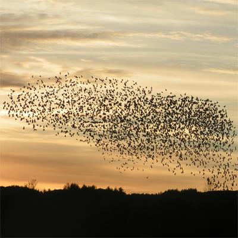

# Complex Systems

Complex systems, that are scientifically and sociologically challenging to interpret, exist all around us: from transport and logistics, to biological mechanisms, and the economy. Scalable complex systems simulation has generated a wealth of novel findings on previously impenetrable data related to, for example, the impact of behaviours within a system, the emergent properties of systems interactions, and the broader implications of the system on society. 

Multi-agent modelling and simulation is a viable solution to discovery and understanding of complex systems. By simulating entities as individuals, insight into micro-interactions and macro-level behaviour can be observed in the natural habitat. Modelling many individuals is however, computationally expensive and raises a number of technical challenges with respect to; the potential scalability of simulations, the algorithms used for managing data and communication, and techniques to optimise performance of large simulations. Previous research, including high profile grand challenge projects such as The Human Brain Project, have favoured a domain-specific approach to solving these issues. The major disadvantage of domain-specific solutions are they lack the flexibility to have translational impact beyond a single domain. 

The FLAME packages are a unified software approach to modelling and simulation of complex systems using a multi-agent approach.  FLAME is targeted at traditional distributed memory HPC architectures, while FLAME GPU utilises NVIDIA GPUs to perform data parallel simulations. The ideas driving [FLAME GPU](./FLAMEGPU) are shared in other research areas, for example [computational biology and neuro-informatics](./biology) requires the same expertise in solving problems relating to large scale simulation of connected cellular systems (which are analogous to those of multi agent systems). [Computer graphics and Virtual Reality (VR)](./graphics) provide an excellent mechanism in demonstrating the use of complex systems simulation.

