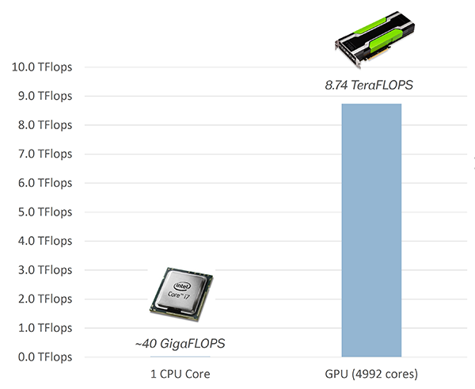

# The Importance of GPUs in Research

Escalating demand for High Performance Computing (HPC) is driven by the need to solve complex simulations on increasingly large scales that cannot be approached using other methods. Modelling and simulation of complex problems has become an established 'third pillar' of science, complementary to theory and experimentation. In order to deliver the required computational research support and advancement on an international level and scale, an EPSRC appointed panel of experts (on HPC) suggested that;

_"Many areas of research in the future will be only accessible to those with advanced computational technology and platforms"._

Optimum accessibility and utilisation of advanced platforms requires significant advances in both software infrastructure and expertise. A considerable investment in training current and future software engineers to ensure they are supported in addressing contemporary modelling and simulation challenges is necessary.

HPC is reliant on advances in hardware and software. In the last ten years, the use of accelerators (including GPUs) as an architecture for computational science has emerged. 50% of the top ten supercomputers are reliant on accelerated computing. In 2017, the Titan supercomputer (currently rated 2nd in the world) will be superseded by Summit due, in part, to its higher GPU capacity. When considering energy performance, accelerators demonstrate substantially higher efficiency than traditional processing cores due to their design, which commits higher die space to raw computing. The top 22 of the Green 500  (highest ranked energy efficient supercomputers) machines are reliant on accelerators. Given the rising energy costs associated with HPC, it is difficult to imagine a future where accelerators will not play a critical role. 

# More information

If you are researcher the please read about [research software consultancy](./research) and consider joining the Sheffield GPU computing [GPUComputing@Sheffield](./gpucomputingatsheffield). If yoy are from industry and would like to know more about working with me then please read about [industrial research consultancy](./industry).
